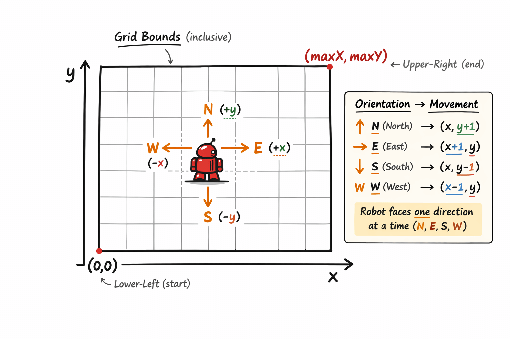

# Martian Robots

A small TypeScript CLI for the classic Martian Robots problem.

Robots move on a rectangular grid using `L`, `R`, and `F` commands.  
If a robot goes off the edge, it is **LOST** and leaves a scent so future robots ignore the same fatal move.

Built with Node, TypeScript, and Vitest.



**Prerequisites:** Node (see `.nvmrc`), pnpm.

## Quick start

```bash
nvm use
pnpm install
pnpm run build
pnpm start
```

**Interactive mode:**  
- manually enter or paste input
- finish with Ctrl+D (Mac/Linux) or Ctrl+Z + Enter (Windows)

**Run the official sample:**  
```bash
pnpm run:sample
```

**Run using a file:**  
```bash
node dist/cli.js path/to/input.txt
```

**Run a sample file (after `pnpm run build`):**  
Copy and paste any of these:

| Sample | Command |
|--------|---------|
| Official example (3 robots) | `node dist/cli.js samples/sample-01-official.txt` |
| Single robot, simple movement | `node dist/cli.js samples/sample-02-simple.txt` |
| Robot immediately LOST | `node dist/cli.js samples/sample-03-immediate-lost.txt` |
| Scent prevents second loss | `node dist/cli.js samples/sample-04-scent.txt` |
| Multiple robots, mixed outcomes | `node dist/cli.js samples/sample-05-mixed.txt` |
| Rotations only (no F) | `node dist/cli.js samples/sample-06-rotations-only.txt` |
| Edge walking (safe) | `node dist/cli.js samples/sample-07-edge-walking.txt` |
| Large grid (50×50) | `node dist/cli.js samples/sample-08-large-grid.txt` |
| Robot near edge but survives | `node dist/cli.js samples/sample-09-survives.txt` |
| Multiple scents in play | `node dist/cli.js samples/sample-10-multiple-scents.txt` |
| Long instruction string | `node dist/cli.js samples/sample-11-long-instructions.txt` |
| Minimal grid (0×0, any F is LOST) | `node dist/cli.js samples/sample-12-minimal-grid.txt` |
| **Edge case:** Scent is per-orientation (N lost ≠ E lost) | `node dist/cli.js samples/edge-01-scent-orientation.txt` |
| **Edge case:** After scent skip, robot continues commands | `node dist/cli.js samples/edge-02-scent-skip-continues.txt` |
| **Edge case:** LOST stops command execution immediately | `node dist/cli.js samples/edge-03-stop-on-lost.txt` |

**Or:**  
- run `pnpm run build && pnpm start`
- copy & paste the contents of these individual files in the terminal
- and press `CTRL+D` (Mac/Linux) or `Ctrl+Z` + `Enter` (Windows)


## Approach

This project is intentionally simple and readable. See [PLANNING.md](./PLANNING.md) for how the solution was approached and key trade-offs.

**Goals:** 
- clear domain logic
- predictable state transitions
- strong TypeScript without over-engineering
- pure core logic, easy to test
- thin CLI layer

**Core idea:**  
```bash
parse -> simulate -> format
```

**Structure**  
```bash
src/
  types.ts        # Domain types + helpers
  movement.ts     # L/R/F movement logic (pure)
  parser.ts       # Input parsing + validation
  simulator.ts    # Robot execution + scent rules
  cliHelpers.ts   # parse -> simulate -> format
  cli.ts          # CLI entrypoint
  *.test.ts       # Vitest tests

sample-input.txt   # Same as samples/sample-01-official.txt
samples/           # sample-01-official, sample-02-simple, sample-03-immediate-lost,
                   # sample-04-scent, sample-05-mixed, ... sample-12-minimal-grid
assets/
```

## Runtime flow
```bash
stdin/file -> parse -> simulate -> format -> stdout
```

- Parser validates input and builds domain objects.
- Simulator runs robots sequentially and tracks scents.
- Format step (in cliHelpers) outputs one line per robot (spec-compliant).
- CLI handles I/O and labels; results go to stdout so output is pipeable.

## Input format
```bash
maxX maxY
x y O
COMMANDS
x y O
COMMANDS
```

**Example:**  
```bash
37 20
1 1 E
RFRFRFRF
3 2 N
FRRFLLFFRRFLL
```

**Rules:**  
- Orientation: N E S W
- Commands: L R F
- Command line has no spaces
- All letters = uppercase
- Robots execute one at a time

## Scripts

| Script            | Description          |
| ----------------- | -------------------- |
| `pnpm run build`  | Compile TypeScript   |
| `pnpm start`      | Run CLI (stdin mode) |
| `pnpm run:sample` | Run sample input     |
| `pnpm test`       | Run tests            |
| `pnpm test:watch` | Watch mode           |
| `pnpm lint`       | Lint source          |

Run `pnpm test` after clone to verify the setup.

## Notes

- Movement logic is pure.
- Bounds + scent handling live in the simulator.
- Scent is tracked by position + orientation.
- Output stays plain text so it matches the original problem spec.

### Licence
MIT

